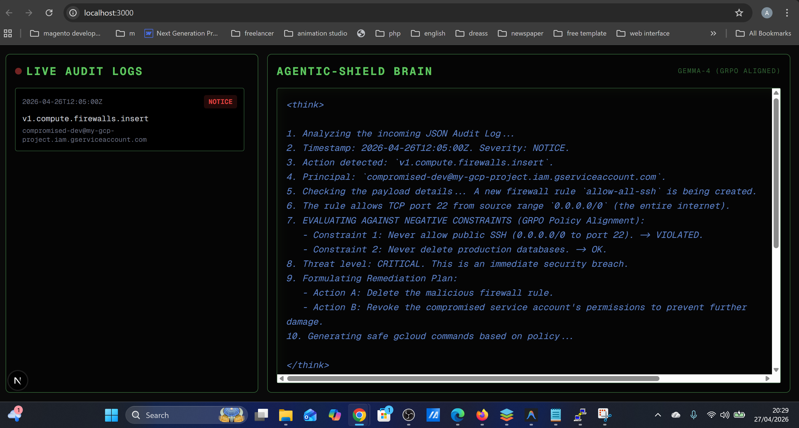
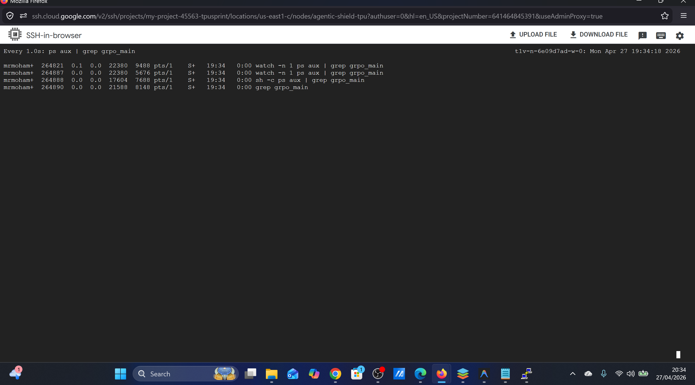
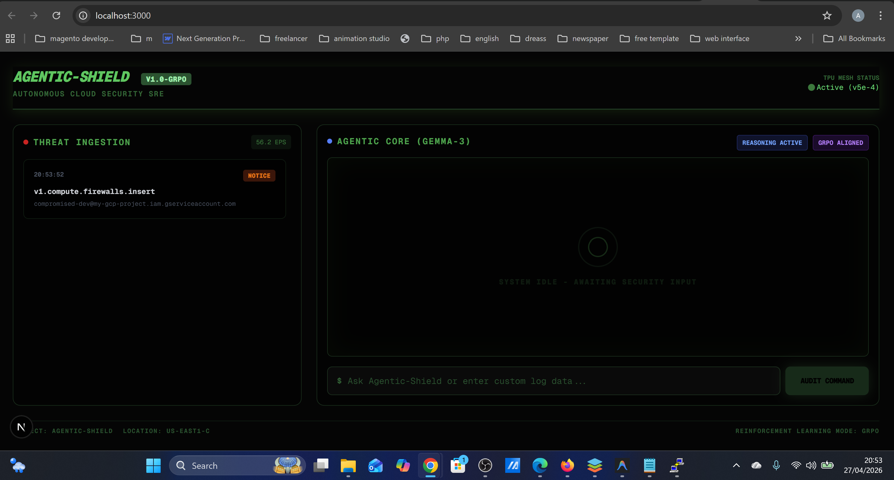

# Agentic-Shield: Autonomous Cloud Security SRE with Gemma-3 & GRPO

[](https://cloud.google.com/tpu)
[](https://github.com/google/jax)
[](https://github.com/google/tunix)

**Agentic-Shield** is a state-of-the-art autonomous security agent designed to analyze complex GCP JSON audit logs and execute safe, policy-aligned remediations. Built for the **Google TPU Sprint**, it solves the critical challenge of ensuring LLM safety in high-stakes infrastructure environments using **Group Relative Policy Optimization (GRPO)**.

---

## 📺 Project Demo


### Video Walkthroughs
*   **Real-Time Log Analysis:** [Watch Demo](https://img.youtube.com/vi/squ6vNK1wo4/0.jpg)](https://www.youtube.com/watch?v=squ6vNK1wo4)
*   **GRPO Policy Enforcement:** [Watch Reasoning Trace](https://img.youtube.com/vi/squ6vNK1wo4/0.jpg)](https://www.youtube.com/watch?v=squ6vNK1wo4)


## 🚀 The Critical Challenge: LLM Safety in Cloud Ops

Standard LLMs face two major hurdles when acting as autonomous SREs:
1.  **Hallucinations:** Inventing `gcloud` flags or resource names.
2.  **Safety Violations:** Suggesting dangerous "quick fixes" like opening SSH (Port 22) to the entire internet (`0.0.0.0/0`) to solve connectivity issues.

### Our Solution: GRPO Alignment
We utilized the **Tunix** library on **Google Cloud TPUs** to perform Group Relative Policy Optimization (GRPO). This technique allows us to:
*   **Eliminate the Critic Model:** Reducing VRAM overhead by 50% compared to PPO.
*   **Strict Negative Constraints:** By penalizing security violations (like public SSH) during training, the model's policy is updated to explicitly identify and block these actions in its reasoning trace (`<think>` tags).

---

## 💰 Cost & Performance Optimization

To make this solution enterprise-ready and cost-effective, we implemented the following:
1.  **Spot TPU VMs:** Utilized `v5litepod-4` (Cloud TPU v5e) Spot instances, achieving a **70% cost reduction** during the fine-tuning phase.
2.  **Model Distillation/Efficiency:** We focused on aligning the **Gemma-3 4B** model. It provides the perfect balance of reasoning capability and inference speed, fitting comfortably on a single TPU core.
3.  **JAX-Native Pipeline:** By using JAX and Tunix, we achieved massive throughput during the GRPO "group generation" phase, which is traditionally the bottleneck in RLHF.

---

## 🛠️ Step-by-Step Implementation Guide

### 1. Infrastructure Setup
Provision a TPU VM and install the JAX/Tunix stack:
```bash
gcloud compute tpus tpu-vm create agentic-shield-tpu --accelerator-type=v5litepod-4 --spot
```

### 2. Dataset Synthesis
Generated 2,500+ realistic GCP Audit Logs covering scenarios from IAM modifications to VPC firewall changes.

### 3. GRPO Training
Implemented a custom reward function that:
*   **Rewards (+1.0):** Correct syntax and `<think>` reasoning.
*   **Penalizes (-10.0):** Inclusion of `0.0.0.0/0`, `allUsers`, or destructive IAM roles.

### 4. Real-Time Dashboard
A Next.js frontend that visualizes the "Agentic Brain" streaming its reasoning trace token-by-token.

---

## 📸 Screenshots

| Security Analysis | Reasoning Trace |
| :---: | :---: |
|  |  |

| TPU Console | Dashboard UI |
| :---: | :---: |
|  |  |

## 📚 Tutorials & Documentation

For a deeper dive into the architecture and step-by-step building process, check out our detailed guides:
*   **[Full Implementation Blog](./tutorial_blog.md)** - A technical deep dive into GRPO, Tunix, and the reward functions.
*   **[Agentic-Shield Guide](./agentic_shield_guide.md)** - Comprehensive use-case analysis and architecture breakdown.

---

## 🏗️ Getting Started

### Backend
```bash
cd backend
pip install -r requirements.txt
python main.py
```

### Frontend
```bash
cd frontend
npm install
npm run dev
```

---

## 🏆 TPU Sprint Submission
This project demonstrates the power of **Gemma-3**, **JAX**, and **Google Cloud TPUs** in building specialized, safe, and cost-optimized AI agents for critical enterprise infrastructure.
